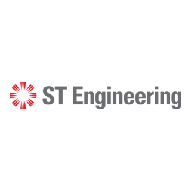
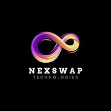
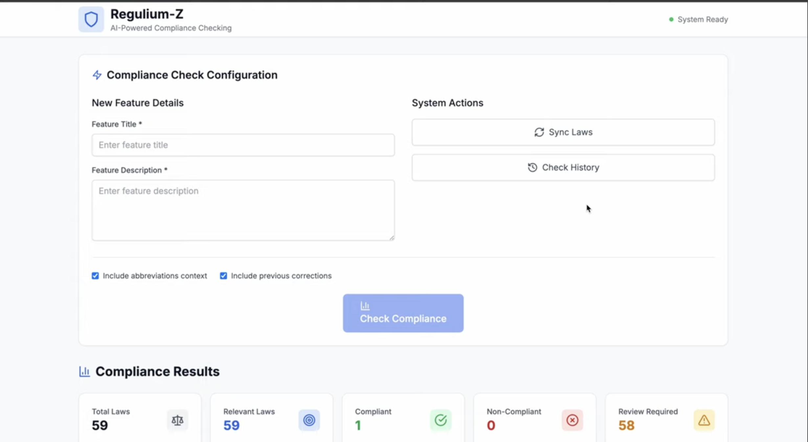
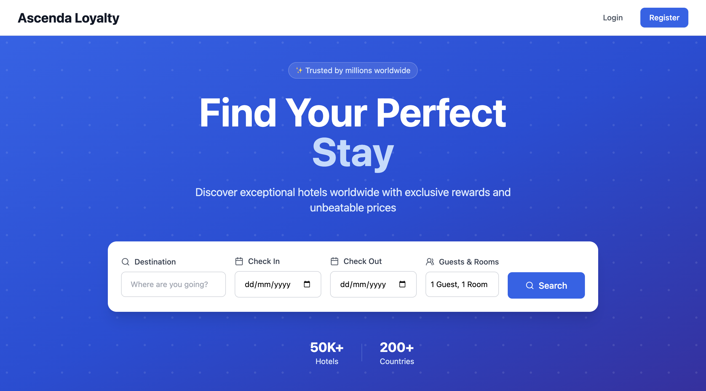
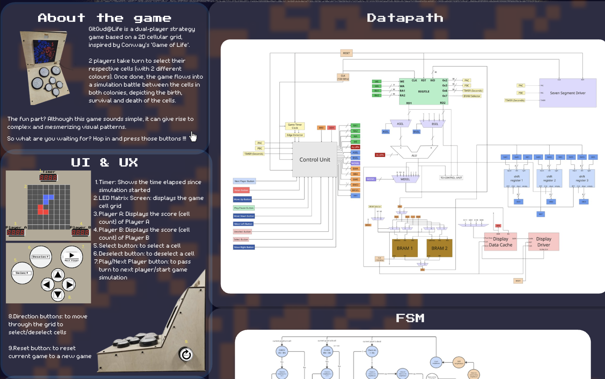
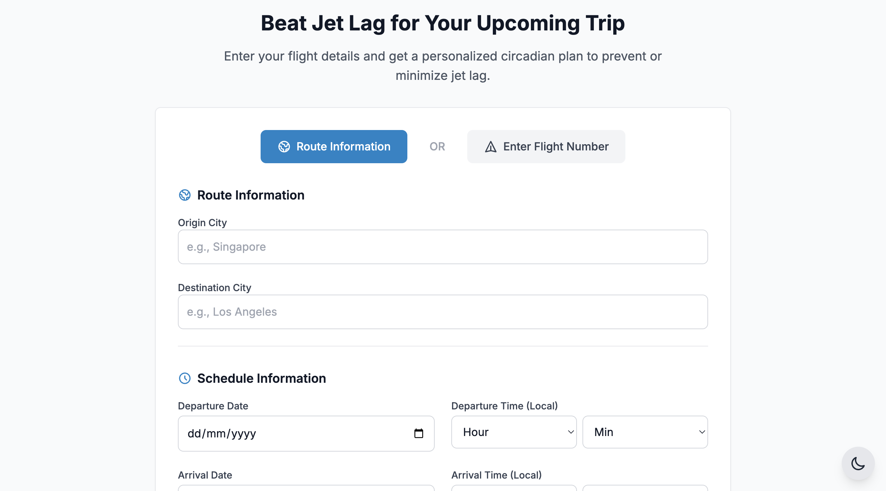
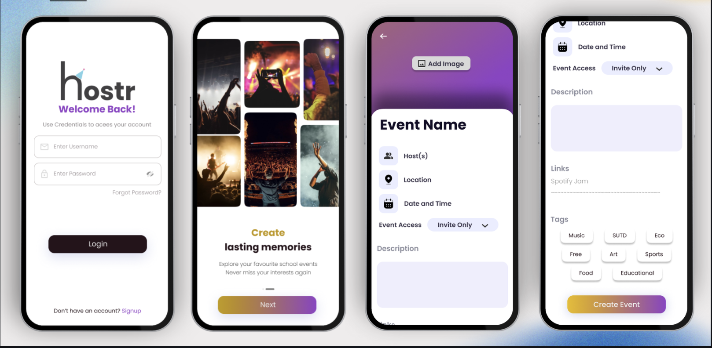
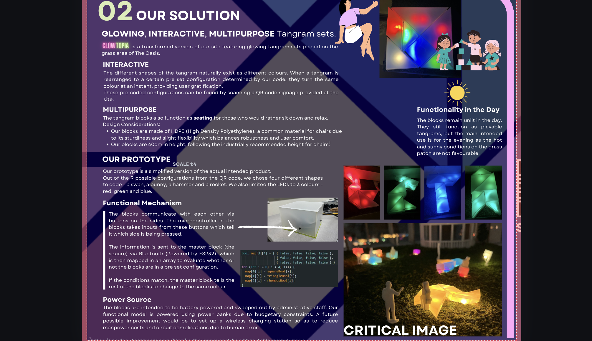

## 💫 About Me

I’m a Final Year **CS** student @ **SUTD**, interested in building AI and software systems for real-world challenging applications, and experimenting with latest technologies to push boundaries of existing solutions :)

**Currently working on:** 
- Developing a **real-time edge-AI library** on Nvidia Jetson for Weather-Invariant Aerodynamic Sampling System for Automated Shipping Container Inspection (Capstone Project)
- A reliable, fool-proof **attendance tracking system** for large classes, with automated trend analysis (Software Studio) 

## 🧑🏻‍💻 What I Love Working With

- Applied AI R&D across multimodal domains (Language, Vision, Audio, and Action)
- Backend and Systems Engineering 
- Edge AI and IoT Applications

## 🛠️ Work Experiences

<table>
	<tr>
		<td width="35%" valign="top" align="center">
			
		</td>
		<td width="65%" valign="top">
			<h3><strong>AI/ML Engineering Intern</strong></h3>
			<h4>ST Engineering (Advanced Networks and Sensors)</h4>
			
<strong>Period:</strong> Jun 2026 – Sep 2026

		</td>
	</tr>
	<tr>
		<td width="35%" valign="top" align="center">
			
		</td>
		<td width="65%" valign="top">
			<h3><strong>Deep Learning Research Intern</strong></h3>
			<h4>Panasonic R&amp;D Center Singapore</h4>
			
<strong>Period:</strong> Sep 2025 – Jan 2026

		</td>
	</tr>
	<tr>
		<td width="35%" valign="top" align="center">
			
		</td>
		<td width="65%" valign="top">
			<h3><strong>IoT &amp; Embedded Software Intern</strong></h3>
			<h4>NexSwap</h4>
			
<strong>Period:</strong> Feb 2025 – Apr 2025

		</td>
	</tr>
</table>

## 🛠️ Project Directory

<table>
	<tr>
		<td width="33%" valign="top">
			
			<h3>Regulium-Z</h3>
			
<strong>Type:</strong> AI-Assisted Compliance Checker Web App

			
<strong>Stack:</strong> React, TypeScript, Tailwind CSS, Node.js, Express.js, OpenRouter, GPT4/Gemini

			
An AI-powered regulatory compliance assistant that matches product features against laws using intelligent relevance filtering, risk assessment, and actionable recommendations. This was a submission for TikTok Techjam 2025.
			

		</td>
		<td width="33%" valign="top">
			
			<h3>HotelEase</h3>
			
<strong>Type:</strong> Full-Stack Hotel Booking Platform

			
<strong>Stack:</strong> React, TypeScript, Tailwind CSS, Node.js, Express.js, MongoDB, Stripe

			
A hotel booking web app with destination search, room selection, secure payments, JWT authentication, and a smooth end-to-end booking flow. Made for Ascenda Loyalty.

		</td>
		<td width="33%" valign="top">
			
			<h3>GitGud@Life</h3>
			
<strong>Type:</strong> FPGA-based Dual Player Gaming Console

			
<strong>Stack:</strong> Lucid HDL, Alchitry Au FPGA, Beta CPU datapath, Digital Logic Design

			
A dual-player strategic game based on cellular automata and propagation, inspired by Conway’s Game of Life. Built on the Alchitry Au FPGA with the Beta CPU datapath and two complementary BRAM modules. I was involved with its UI/UX design, physical console fabrication, electronic design, and hardware assembly.

		</td>
	</tr>
	<tr>
		<td width="33%" valign="top">
			
			<h3>Snorelags</h3>
			
<strong>Type:</strong> Smart Jetlag Planner Web App

			
<strong>Stack:</strong> React, TypeScript, FastAPI, Python, Supabase, Gemini, WeatherAPI

			
A full-stack jetlag recovery planner that generates personalized jet lag and shift-work recovery schedules using AI, and provides weather-aware guidance, daily checklists, and habit tracking. Built for SUTD WhatTheHack 2025.

		</td>
		<td width="33%" valign="top">
			
			<h3>Hostr</h3>
			
<strong>Type:</strong> Event Discovery &amp; Management Android App

			
<strong>Stack:</strong> Java, XML, Firebase, Glide, PhotoView, CircleImageView, Spotify Jam

			
A peer-to-peer event management and discovery app that helps students organize informal events, track RSVPs, coordinate with friends, share event photos, and boost engagement through social discovery and music integration.

		</td>
		<td width="33%" valign="top">
			
			<h3>Glowtopia</h3>
			
<strong>Type:</strong> IoT-Enabled Interactive Smart Seats

			
<strong>Stack:</strong> ESP32, ESP-NOW (for BLE Wireless Communication), IoT Sensors

			
Tangram-styled and shape responsive smart seat prototypes, to transform an underutilised outdoor space at The Oasis at Changi City Point, into a more engaging social area. The seats use distributed sensing and wireless communication to detect user-arranged configurations and synchronously change LED lighting when a predefined shape is formed.

		</td>
	</tr>
</table>

## 💻 Tech Stack

### Languages

### AI/ML

### Frontend

### Backend & Data

### Tools

## 📫 Contact

- Mobile: **+65 86728925**
- Email: **1008002@mymail.sutd.edu.sg** 
- LinkedIn: **https://www.linkedin.com/in/raj-sikder-a935311a9**

